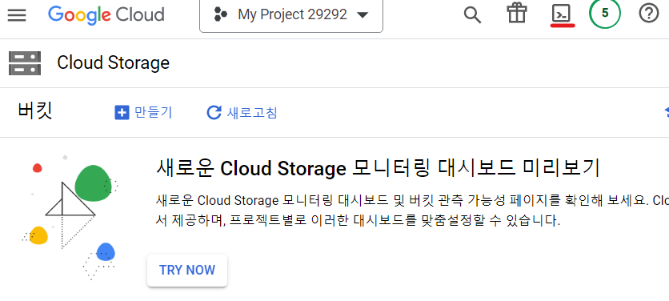
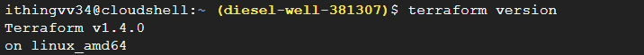
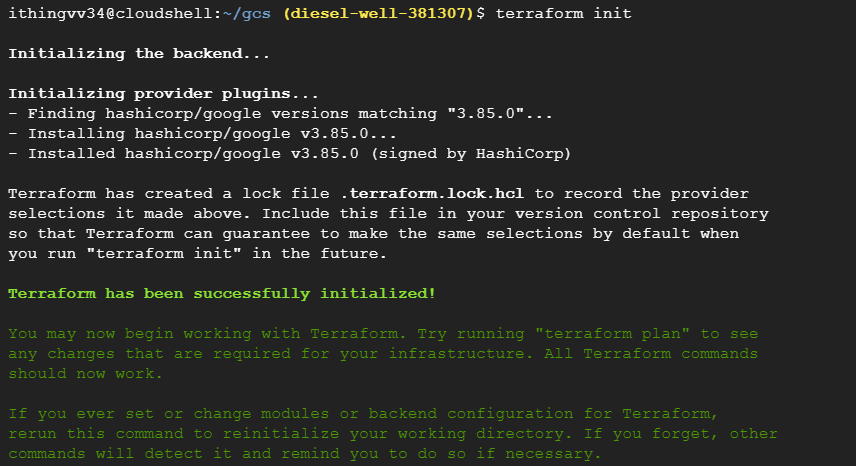
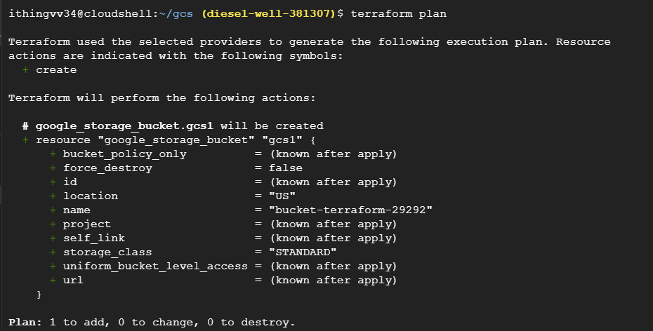
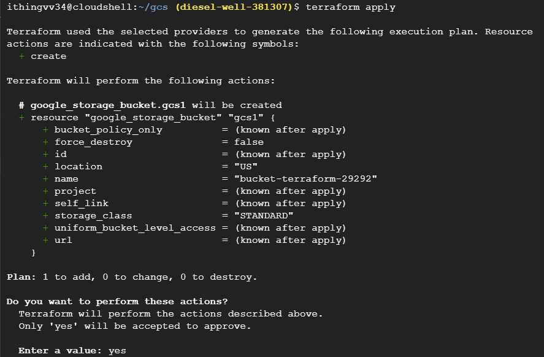
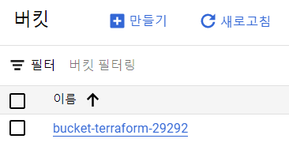

# Google Cloud Shell을 통한 인증

1. GCP Console에 접속하여 terraform 인프라를 설정할 프로젝트를 선택한다.
2. cloud shell에 접속한다.
   
   
3. terraform 버전을 확인한다.
    ```
    terraform version
    ```
    
4. vi 파일을 열어 main.tf 파일을 복사 붙여넣기 한다.
   ```
    mkdir gcs && cd gcs

    # vi main.tf

    terraform {
        required_providers {
        google = {
            source = "hashicorp/google"
            version = "3.85.0"
        }
        }
    }

    provider "google" {
        project = "diesel-well-381307"
        region = "us-central1"
        zone = "us-central1-f"
    }

    resource "google_storage_bucket" "gcs1" {
        name = "bucket-terraform-29292"
    }


    # wq!
   ```
5. terraform init
   
6. terraform plan
    
7. terraform apply
    
8. 생성된 버킷 확인
    